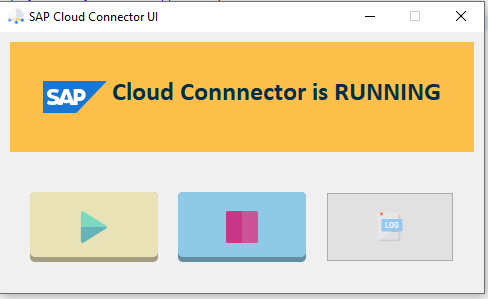

# SAP Cloud Platform Cloud Connector Cockpit
[![Build Status][circleci-image]][circleci-url]
[![Dependency Status][daviddm-image]][daviddm-url]
[](https://api.reuse.software/info/github.com/SAP-samples/cloud-foundry-cap-azure-cities)


## Description
This is a sample application that can be used as a cockkpit for the SAP Cloud Connector for SAP Cloud Platform. Besides [CDS](https://help.sap.com/viewer/cca91383641e40ffbe03bdc78f00f681/Cloud/en-US/e6c7616abb5710148cfcf3e75d96d596.html?q=cloud%20connector) tooling, this application is written in JAVA.

The application starts, stops cloud connector. exposes logs.




## Requirements

- Install Java JDK.
 

### Local Development
This project is developed in eclipse. For local development, each one can be started independently. 
I recommend using Eclipse.

1. Clone the project.
    ```
    git clone https://github.com/fistofzen/CloudConnectorCockpit.git
    cd CloudConnectorCockpit
    and start development
    ```
 

## Architecture

## Known Issues
None so far :)

## How to obtain support
This content is provided "as-is" with no other support.

 
